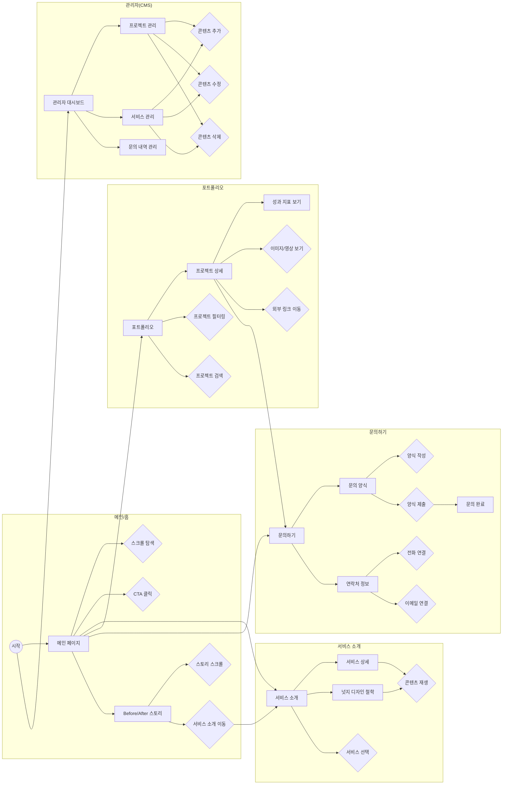

```mermaid
flowchart LR

  subgraph s1 ["메인/홈"]
    n1(("시작"))
    n2["메인 페이지"]
    n3{"스크롤 탐색"}
    n4{"CTA 클릭"}
    n32["Before/After 스토리"]
    n33{"스토리 스크롤"}
    n34{"서비스 소개 이동"}
  end

  subgraph s2 ["서비스 소개"]
    n5["서비스 소개"]
    n6["서비스 상세"]
    n7["넛지 디자인 철학"]
    n8{"서비스 선택"}
    n9{"콘텐츠 재생"}
  end

  subgraph s3 ["포트폴리오"]
    n10["포트폴리오"]
    n11["프로젝트 상세"]
    n12["성과 지표 보기"]
    n13{"프로젝트 필터링"}
    n14{"프로젝트 검색"}
    n15{"이미지/영상 보기"}
    n16{"외부 링크 이동"}
  end

  subgraph s4 ["문의하기"]
    n17["문의하기"]
    n18["문의 양식"]
    n19["문의 완료"]
    n20{"양식 작성"}
    n21{"양식 제출"}
    n22["연락처 정보"]
    n23{"전화 연결"}
    n24{"이메일 연결"}
  end

  subgraph s5 ["관리자(CMS)"]
    n25["관리자 대시보드"]
    n26["프로젝트 관리"]
    n27["서비스 관리"]
    n28["문의 내역 관리"]
    n29{"콘텐츠 추가"}
    n30{"콘텐츠 수정"}
    n31{"콘텐츠 삭제"}
  end

  n1 --> n2
  n2 --> n3
  n2 --> n4
  n2 --> n5
  n2 --> n10
  n2 --> n17
  n5 --> n6
  n5 --> n7
  n5 --> n8
  n6 --> n9
  n7 --> n9
  n10 --> n11
  n10 --> n13
  n10 --> n14
  n11 --> n12
  n11 --> n15
  n11 --> n16
  n11 --> n17
  n17 --> n18
  n17 --> n22
  n18 --> n20
  n18 --> n21
  n21 --> n19
  n22 --> n23
  n22 --> n24
  n1 --> n25
  n25 --> n26
  n25 --> n27
  n25 --> n28
  n26 --> n29
  n26 --> n30
  n26 --> n31
  n27 --> n29
  n27 --> n30
  n27 --> n31
  n2 --> n32
  n32 --> n33
  n32 --> n34
  n34 --> n5
```
